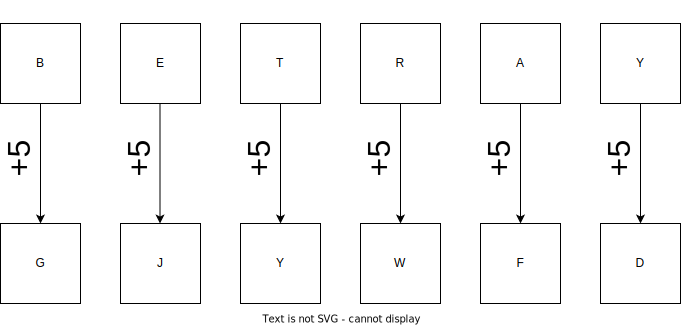
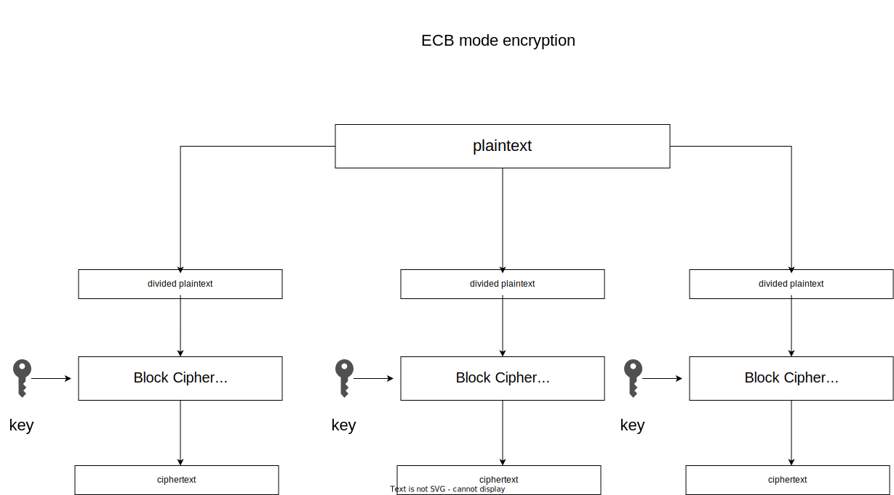

# Introduction

Today's session is about how we secure data in computer systems using math and algorithms.
We will understand why we need cryptography and how we can use it correctly.

# Reminders and Prerequisites

For this session, you will require:
- general understanding of what data is, as discussed in the previous session [Data Representation](../data-representation).
- high school level math

# Encryption

The process of encoding information in a form that is unrecognisable by most human and can only be deciphered by a select few who posses the mean to do so is called encryption. Given a piece of information, that from now on we'll call **plaintext**, we use the process of encryption to transform it to an unreadable form known as **ciphertext**. The purpose of encryption is to allow only authorized parties to decipher a ciphertext back into the original plaintext.
Encryption relies on using a pseudo-random mathematically-generated secret string of characters called **cryptographic key** in order to be able to easily decipher the ciphertext. 


We will talk more about cryptographic keys later in this session were we'll dive deeper into the concepts of symmetric and asymmetric encryption schemes.

# Classical Ciphers

Since Greek and Roman times people needed a way to exchange information safely. 
Without complex mathematics and algorithms people found intuitive ways to codify their messages.

Classical ciphers were of two types: substitution and transposition of letters.

## Caesar Cipher

One of the most known and simple classical ciphers, named after the great Roman conqueror Julius Caesar, who also used it to communicate with his crush Cleopatra, works by using the alphabet substition of a letter by a given shift.

For example if we set our shift to +5 we can see how the cipher works in the following drawing 

# Exclusive Or

Exclusive or, also called "XOR" is a binary operator that behave like an programmable inverter so as the output is true if either first or second input is true but not both.


> You will also find XOR operation described by `⊕` symbol in textbooks.

## XOR Properties

To get familiar with how XOR operates we will take a brief look at some of its properties.

$$  0 ⊕ 0 = 0 \qquad 1 ⊕ 0 = 0 $$

$$  0 ⊕ 1 = 1 \qquad 1 ⊕ 1 = 0 $$

From now on we can determine some arithmetical attributes from that:

|||
|---|---|
|  a ⊕ (b ⊕ c) = (a ⊕ b) ⊕ c  | XOR can be applied in any order|
|  a ⊕ a = 0 | XORing a bit with itself is always 0 
|  a ⊕ 0 = a | XORing a bit with 0 doesn't change the bit value
|  a ⊕ b = b ⊕ a  |You can flip the operands order|

## XOR Encryption

We can combine the previously mentioned properties in order to obtain a cool property that's used for decryption:
$a ⊕ b ⊕ a = b$ 

The first XOR between $a$ and $b$ is the encryption part whereas the second XOR operations marks the decryption phase:
$
ciphertext = plaintext ⊕ key\\
ciphertext ⊕ key  = plaintext ⊕ key ⊕ key = plaintext
$

We only defined the XOR as working on single bits, so in order to be able to use the XOR for encryption we need to implement a bitwise XOR function that can operate on more than one bit.

Luckily for us, Python already provide us with the `^` (caret) operator that can be applied to integers to XOR them.
It works by XOR-ing each 2 corresponding bits of the two integers.


```python
'''
Here we can see the process of bitwise XORing two numbers
42 ⊕ 69 = 0b101010 ⊕ 0b1000101
         = 0 1 0 1 0 1 0 
               ⊕         we apply the XOR operation to every one of the bits
           1 0 0 0 1 0 1
           ↓ ↓ ↓ ↓ ↓ ↓ ↓
         = 1 1 0 1 1 1 1
'''
print(int('0b1101111', 2)) # convert binary to decimal
print(42 ^ 69)

# Function to xor strings
def xor_strings(w1, w2):
        return "".join([chr(ord(a) ^ ord(b)) for a,b in zip(w1, w2)])

print(xor_strings("111","bbb").encode())
```

## OTP (One Time Pad)

At a first glance, XOR may look too simple to provide a secure encryption scheme but it is the basis of the moste secure encryption algorithm, called a **one-time pad**.
The name suggests using a random sequence of bits called `pad` with which we XOR each bit in the plaintext.
The security is guaranteed by the fact that the pad must be only used once therefore the name.

But how exactly does OTP work?

Given a plaintext that can be translated into binary data and the previously mentioned pad made up of random and unpredictable bits, the attacker won't have any clue about the plaintext when they see the ciphertext.


You will probably think "Why don't we use OTP's if it's impossible for an attacker to decipher it if the OTP's rules are implemented correctly?".
The problem is OTP is impractical: if the data you want to transmit is big then the pad must be at least the size of the data.
Also you'll have to transmit the pad to other parties ahead of time in order to get it deciphered in practical time.

# Symmetric Cryptography

Symmetric ciphers are encryptions alghoritms that uses the same key for both encrypting and decrypting data.

Symmetric-key ciphers are of two types:
- **block ciphers** that breaks up the plaintext into multiple fixed-length size blocks and send each block through an encryption function alongside with the secret key. 
- **stream ciphers** takes a different approach by encrypting one byte of plaintext at a time

We will focus on block ciphers, specifically on **AES**(Advanced Encryption Standard) which is the most famous symmetric-key cipher. Many modern processor contain special instruction sets to perform AES operations and you can find more about that in the Hardware Section of SSS.

## How AES works?

AES is basically just a keyed permutation. In other words it maps every possible input block to another unique output block determined by a key.

AES comes in 3 variants where the key sizes can be 128, 192 or 256 bits and the block size of 128 bits.

In order for AES to perform an keyed permutation that can't be inverted without the key, the algorithm applies mixing operations on the input. 

Because the size of the block is 128 bits (16 bytes), we represent them by a 4x4 matrix of bytes. In the 128 bits-key AES version there are 10 rounds where the initial 4x4 matrix is modified each round by a number of invertible operations. 

Steps of AES Encryption:

1. Key Expansion 
    - from the 128 bit key we generate 11 separate 128 "round keys" each to be used in **Add Round Key** step
2. Initial Add Round Key 
    - the bytes of the first round key are XOR'd with the current block matrix
3. Round 
    - this step is looped 10 times
    - **Substitute Bytes** - each byte of the state is substituted with a different byte according to a lookup table called **S-box**
    - **Shift Rows** - transposition of the last three rows of the block matrix shifted over one, two or three columns
    - **Mix Columns** - matrix multiplication is performed on block matrix columns combining the four bytes in each column. In the last round this step is skipped
    - **Add Round Key** - the bytes of the current round key are XOR'd with the current block matrix


## Block cipher mode of operation

Block ciphers seems to solve the OTP key size problem but "what if we want to encrypt more than a block of data?". We will need to use a block cipher mode of operation. The mode of operation describes how to securely apply the cipher's single-block operation to transform data larger than the block size.


### ECB

ECB stands for Electronic Codebook and is the simplest and not to be used encryption mode. The way it works it's straightforward: the message is divided into multiple blocks and each block is encrypted separately.



The main security issue with ECB mode is that encrypting the same block of plaintext always returns the same block of ciphertext.

From now on we'll be using the Crypto module from the PyCryptoDome package. You can install it via pip by using the **pip install pycryptodome** command in your Linux terminal.
```python
from Crypto.Cipher import AES
from Crypto.Random import get_random_bytes
from Crypto.Util.Padding import pad

KEY = get_random_bytes(16) #generate a random 16 bytes key

plaintext = b"$ecret_1nformat1on"

cipher = AES.new(KEY, AES.MODE_ECB)
ciphertext = cipher.encrypt(pad(plaintext, 16))

#Encryption 
print(f"Key: {KEY}")
print(f"Ciphertext: {ciphertext}")

decrypted_plaintext = cipher.decrypt(ciphertext) # we don't need to specify the key because we are using the cipher object initialized with the Key
print(f"Plaintext: {decrypted_plaintext}") 
```

### CBC

CBC stands for Cipher Block Chaining and it works by XORing each ciphertext block with the previous one. 

In order for CBC to be secure and solve the similarity issue of ECB we must use a random sequence of bytes called **IV** (initialization vector) in the first block XOR operation.


```python
from Crypto.Cipher import AES
from Crypto.Random import get_random_bytes
from Crypto.Util.Padding import pad

KEY = get_random_bytes(16) # generate a random 16 bytes key

plaintext = b"$ecret_1nformat1on"

cipher = AES.new(KEY, AES.MODE_CBC) #
ciphertext = cipher.encrypt(pad(plaintext, AES.block_size))

#Encryption 
print(f"Key: {KEY}")
print(f"IV: {cipher.iv}") # The library will create a random IV if not specified when we create the AES object 
print(f"Ciphertext: {ciphertext}")

cipher = AES.new(KEY, AES.MODE_CBC, cipher.iv) # we initialize a new object specifying the IV used in the encryption

decrypted_plaintext = cipher.decrypt(ciphertext) 
print(f"Plaintext: {decrypted_plaintext}") 
```
# Asymmetric Cryptography

Asymmetric Cryptography is a cryptography system that uses two keys: a public key(which as the name suggests may be known by others) and private key(which must only be known by the owner)


## Summary

- Sumamrizing session concepts
- Summarizing commands / snippets that are useful for tutorials, challenges (easy reference, copy-paste)

## Activities

Tasks for the students to solve. They may be of two types:
- **Tutorials** - simpler tasks accompanied by more detailed, walkthrough-like explanations
- **Challenges** - the good stuff

## Further Reading

Any links or references to extra information.