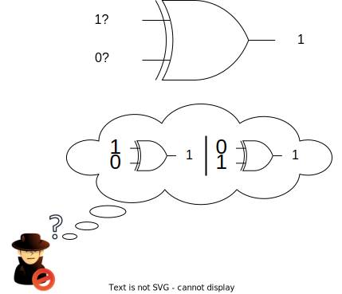

# Introduction

Today's session is about how we secure data in computer systems using math and algorithms.
We will understand why we need cryptography and how we can use it correctly.

# Reminders and Prerequisites
- general understanding of what data is, as discussed in previous session [Data Representation](../data-representation).
- high school level math


# Encryption

The process of encoding information is called encryption. 

Given an information, that we'll call it from now on as `plaintext`, we use the process of encryption to transform it to an unreadable form known as `ciphertext`. 

The purpose of the encryption is to allow only authorized parties to decipher a ciphertext back into the original plaintext.

Encrpytion relies on using a pseudo-random mathematically-generated secret string of characters called `cryptographic key` in order to be able to easily decipher the ciphertext. 


We will talk more about cryptographic keys later in this session were we'll deepen into the concepts of symmetric and asymmetric encryption schemes.

# Classical Ciphers

Since Greek and Roman times people needed a way to exchange information safely. 
Without complex mathematics and algorithms people found intuitive ways to codify their messages.

Classical ciphers were of two types: substitution and transposition of letters.

## Caesar Cipher
One of the most known and simple classical ciphers, named after the great Roman conqueror Julius Caesar whom also used it to communicate with his crush Cleopatra, works by using the alphabet substition of a letter by a given shift.

For example if we set our shift to +5 we can see how the cipher works in the following drawing 

## Vigenere Cipher
TODO

# Exclusive Or

Exclusive or, also called "XOR" is a binary operator that behave like an programmable inverter so as the output is true if either first or second input is true but not both.


>You will also find XOR operation described by `⊕` symbol in textbooks.

## XOR Properties

To get familiar with how XOR operates we will take a brief look at some of it's properties.

$$  0 ⊕ 0 = 0 \qquad 1 ⊕ 0 = 0 $$
$$  0 ⊕ 1 = 1 \qquad 1 ⊕ 1 = 0 $$

From now on we can determine some arithmetical attributes from that:

|||
| ---|----|
| $ a ⊕ (b ⊕ c) = (a ⊕ b) ⊕ c $ | XOR can be applied in any order|
| $ a ⊕ a = 0 | XORing a bit with itself is always 0 
| $ a ⊕ 0 = a | XORing a bit with 0 doesn't change the bit value
| $ a ⊕ b = b ⊕ a $ |You can flip the operands order|


## XOR Encryption

We can combine the previously mentioned properties in order to obtain a cool property that's used for encryption:

$a ⊕ b ⊕ a = b$ 

The first XOR between $a$ and $b$ is the encryption part whereas the second XOR operations marks the decryption phase.

We only defined the XOR as working on single bits, so in order to be able to use the XOR for encryption we need to implement a bitwise XOR function to operate it on many bits.

Luckily for us, Python already provide us with the `^` (caret) operator that can be applied betwwen integers to XOR them. It works by converting the two integers to binary and then performin XOR operation on each of them bits.


```python
'''
Here we can see the process of bitwise XORing two numbers
42 ⊕ 69 = 0b101010 ⊕ 0b1000101
        = 0 1 0 1 0 1 0 
               ⊕         we apply the XOR operation to every one of the bits
          1 0 0 0 1 0 1
          ↓ ↓ ↓ ↓ ↓ ↓ ↓
        = 1 1 0 1 1 1 1
'''
print(int('0b1101111', 2)) # convert binary to decimal
print(42 ^ 69)
```

## OTP(One Time Pad)

At a first glance, XOR may look too simple to provide a secure encryption scheme but there is a very unique one called a `one-time pad`. The name suggests using a random sequence of bits called `pad` where the security is guaranteed by the fact that the pad must be only used once therefore the name.

But how exactly does the OTP works?

Given an plaintext that can be translated into binary data and the previously mentioned pad made up of random and unpredictable bits the attacker won't have any clue about the plaintext when they see the ciphertext.



You will probably think why we don't use OTP's if it's impossible for an attacker to decipher it if the OTP's rules are implemented correctly. The problem is they are impractical: if the data you want to transmit is big then the pad must be at least the size of the data, also you'll have to transmit the pad to other parties ahead of time in order to get it deciphered in practical time.


## Summary

- Sumamrizing session concepts
- Summarizing commands / snippets that are useful for tutorials, challenges (easy reference, copy-paste)

## Activities

Tasks for the students to solve. They may be of two types:
- **Tutorials** - simpler tasks accompanied by more detailed, walkthrough-like explanations
- **Challenges** - the good stuff

## Further Reading

Any links or references to extra information.